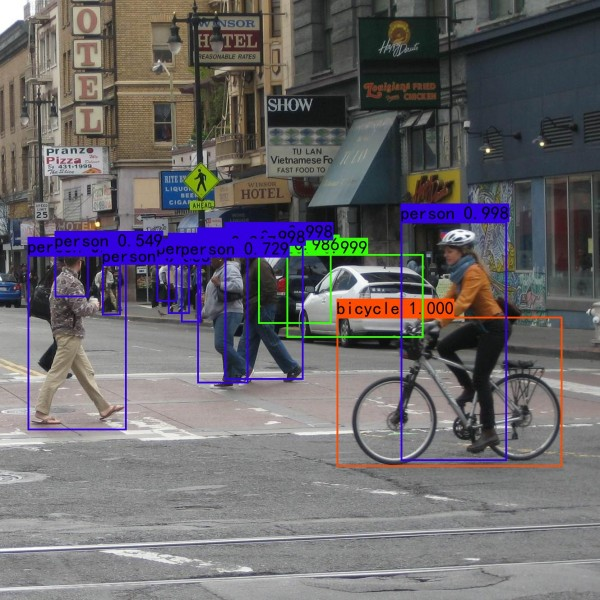
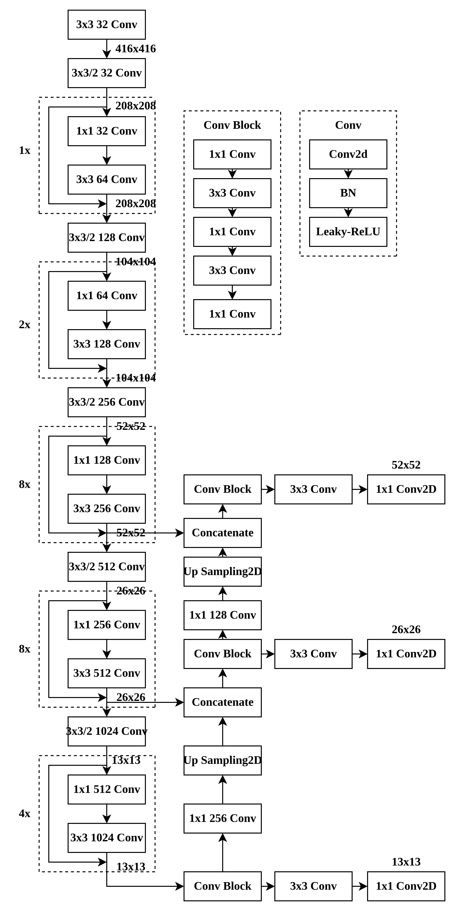

# YOLOV3算法
## 1. 项目描述
通过Pytorch简单实现了[YOLOv3: An Incremental Improvement](https://arxiv.org/abs/1804.02767)

## 2. 代码结构
```angular2html
|--dataset
|    |--data_utils.py ：数据处理配置文件
|    |--yolo_dataset.py ：YOLO数据集操作
|    |--gen_anchors.py ：通过K-Means聚类获取anchors
|--nets
|    |--darknet.py : DarkNet-53网络
|    |--yolo.py : YOLOV3网络
|--utils
|    |--box_utils.py : 用于将预测结果转为真实框box的操作
|    |--loss_utils.py : YOLOV3网络计算损失
|    |--train_utils.py : 训练相关配置
|    |--callbacks.py : 记录日志相关操作
|--model_data
|    |--train.txt ： 训练时使用，每行包含训练图片路径，每张图片中gtbox的位置以及对应的类别
|    |--val.txt ： 验证时使用，每行包含验证图片路径，每张图片中gtbox的位置以及对应的类别
|    |--voc_classes.txt : 类别文件，每行对应一个类别
|    |--yolo_anchors.txt : YOLO中anchor的大小 
|    |--simhei.ttf : 字体文件
|--voc_annotations.py : 用来生成model_data下的train.txt和val.txt
|--train.py : 训练脚本
|--predict.py : 预测脚本
```
## 3. 数据集
   - **VOC数据下载地址：** [http://host.robots.ox.ac.uk/pascal/VOC/](http://host.robots.ox.ac.uk/pascal/VOC/)

## 4. 环境配置
```
numpy==1.21.2
torch==1.9.1
torchvision==0.11.1
pillow==8.3.1
opencv-python==4.5.4.58
scipy==1.7.2
matplotlib==3.4.3
tqdm==4.62.3
```

## 5. 模型效果展示


## 6. 训练自己的模型
1. 数据集的准备
   - 训练前将标签文件放在VOCdevkit文件夹下的VOC2007文件夹下的Annotation中。路径对应于`.gitignore`文件的第2行
   - 训练前将图片文件放在VOCdevkit文件夹下的VOC2007文件夹下的JPEGImages中。路径对应于`.gitignore`文件的第2行

2. 数据集的处理
   在完成数据集的摆放之后，我们需要利用voc_annotation.py获得训练用的train.txt和val.txt。**注意修改classes_path**

3. 开始网络训练
   **注意修改classes_path**，运行`train.py`即可
4. 训练结果预测
   - `model_path`指向训练好的权值文件
   - `classes_path`指向检测类别所对应的txt
   - 修改后就可以运行`predict.py`进行检测了

## 7. YOLOV3网络结构
